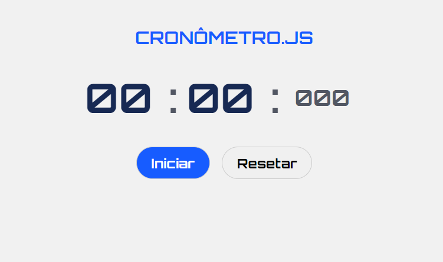

<h1 align="center">Cronômetro JS</h1>

Cronômetro simples e intuitivo, feito com JavaScript.  

  
  

 Acesse o projeto finalizado  <a href="#">aqui</a>

  
 

## Tecnologias

Esse projeto foi desenvolvido com as seguintes tecnologias:

- HTML e CSS
- JavaScript

 

  ## Licença

  Licença MIT